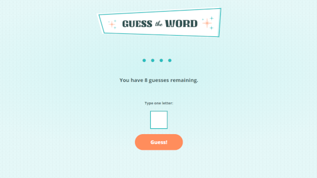

# guess-the-word

# Skillcrush Project - Github Repo Gallery Project

This is a tutorial project I completed with [Skillcrush](https://skillcrush.com/). I followed the instructions given by Skillcrush to create this game. This project creates a game where players have 8 guesses to guess the word that is randomly generated using an API. I coded the JavaScript, API request and used the dev tools to complete this project.

## Table of contents

- [Overview](#overview)
  - [The challenge](#the-challenge)
  - [Screenshot](#screenshot)
  - [Links](#links)
- [My process](#my-process)
  - [Built with](#built-with)
  - [What I learned](#what-i-learned)
  - [Continued development](#continued-development)
- [Author](#author)

## Overview

### The challenge

Users should be able to:

- Play the game guessing one letter at a time to guess the word
- The player has 8 guesses to try to guess the word
- Button to play again if the player lost or won
- New word is generated through API every time the Play Again button is clicked

### Screenshot



### Links

- Live Site URL: [Guess Word Site](https://heathersmanski.com/guess-word-site/)

## My process

### Built with

- JavaScript
- Visual Studio Code
- API

- Skillcrush provided the HTML and CSS while I wrote the JavaScript by following the code instructions to create this project.

### What I learned

- I learned more about github and how to fork a project. I also learned how to commit changes made to the project with gitbash.

- To get the words for the game I used an API that was provided by skillcrush.
  - I used async and await to get a word from the api with the getWord function.
  - I used a console log to check that it was working and it was showing a word
  - The words variable returns all the words that are in the api.
  - Next the wordArray uses split at the break of each word to create and array
  - Now that it is in an array the next steps are to randomly choose one word from the array everytime the site is loaded or guess button is clicked.
  - This function is called globally outside of the function so that every time the website is loaded or refreshed it randomly chooses a new word from the api array.

```js
// Fetches words from API
const getWord = async function () {
  const showWord = await fetch(
    "https://gist.githubusercontent.com/skillcrush-curriculum/7061f1d4d3d5bfe47efbfbcfe42bf57e/raw/5ffc447694486e7dea686f34a6c085ae371b43fe/words.txt"
  );
  const words = await showWord.text();
  // console.log(words);
  const wordArray = words.split("\n");
  const randomIndex = Math.floor(Math.random() * wordArray.length);
  word = wordArray[randomIndex].trim();
  wordPlaceholder(word);
};

// Starts Game with word ready
getWord();
```

- Now that a word is randomly selected from the api the next step was to display it on the site. They key was to use placeholders until the letter was guesses so not to ruin the game.
  - This was achieved by a function named wordPlaceholder.
  - This takes the word that was ransmoly chosen and for each letter it puts a dot as a placeholder.
  - For this function to work it is not only called outside the function but also in the above function that we randomly generated the word.

```js
// Display placeholder
const wordPlaceholder = function (word) {
  const letterPlaceholder = [];
  for (const letter of word) {
    // console.log(letter);
    letterPlaceholder.push("●");
  }
  wordInProgress.innerText = letterPlaceholder.join("");
};
wordPlaceholder(word);
```

- The Guess! button needed to have functionality so an eventlistener was created to tell it what to do when the user clicked on it.
  - The e.preventDefault makes it so that it does not reset the entire game everytime the user clicks on the Guess! button. The user should be able to keep playing until they win or run out of guesses.
  - It clears any messages that are up from the previous guess (we will look at the messages that come up alittle further down in this file)
  - It stores the users guess that was input into the guess box.
  - The users input is than validated to make sure it is a letter (we will look at the validation function next)
  - Lastly it clears the user guess input so that they can guess another letter

```js
// Guess Button
guessBtn.addEventListener("click", function (e) {
  e.preventDefault();

  // Clear message of all text
  message.innerText = "";

  // stores what was entered in the input
  let guess = letterInput.value;
  // console.log(guess);

  // Validates player Input
  const guessValue = playerInput(guess);
  if (guessValue) {
    makeGuess(guess);
  }

  // Clears the input box
  letterInput.value = "";
  // console.log(guessValue);
});
```

- I learned about validating player input to make sure it was only a letter that was guessed. To do this a function was used with an if statement to check all possible senerios
  - The if statement not only checks if it is a valid input but also shows and error message depending on the input the user entered.

```js
// Validate Players input
const playerInput = function (input) {
  const acceptedLetters = /[a-zA-Z]/;
  if (input.length === 0) {
    // Checks if input is empty
    message.innerText = "Please enter a letter to guess";
  } else if (input.length > 1) {
    // checks if more than one letter in input
    message.innerText = "Please guess one letter at a time";
  } else if (!input.match(acceptedLetters)) {
    // Checks if is only a letter
    message.innerText = "Please only guess letters from A to Z";
  } else {
    // if is only one letter it passes
    return input;
  }
};
```

- When the user enters a guess a number of functions are run inorder to update everything for the game.
  - One function that was fun creating and writing the logic for was to count the number of guesses the player used.
  - This function first changes the letters in the word all to uppercase so that it can be evaluated and compared.
  - This game logic checks to see if the letter is included in the word, if the letter has been guessed already, and if the user is on their last guess or has more tries

```js
const countRemainingGuesses = function (guess) {
  const wordToUpper = word.toUpperCase();
  if (!wordToUpper.includes(guess)) {
    message.innerText = `Sorry the word does not contain ${guess}`;
    remainingGuessesCount -= 1;
  } else if (
    wordToUpper.includes(guess) &&
    wordToUpper === wordInProgress.innerText
  ) {
    message.innerHTML = `<p class="highlight">You guessed the correct word! Congrats!</p>`;
  } else {
    message.innerText = `Nice! The word has the letter ${guess}`;
  }

  if (remainingGuessesCount === 0) {
    message.innerHTML = `Game Over :( The word was <span class="highlight">${word}</span>.`;
    startOver();
  } else if (remainingGuessesCount === 1) {
    remainingGuessNum.innerText = `${remainingGuessesCount} guess`;
  } else {
    remainingGuessNum.innerText = `${remainingGuessesCount} guesses`;
  }
};
```

### Continued development

I enjoyed creating the game logic and thinking of all possible senerios and how to make it a seamless game play for the user. I am going to continue to learn more about game logic and logic using JavaScript.

I learned a lot with this project and am looking forward to the next project and learning more!

## Author

- Website - [Heather Smanski](https://heathersmanski.com/)
